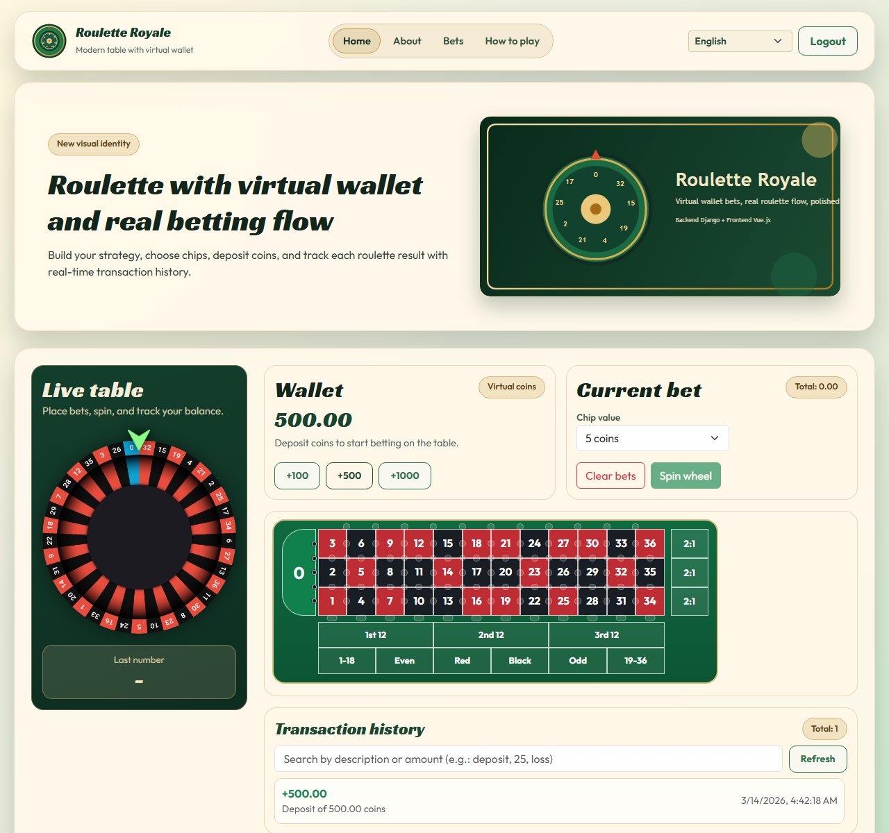

# Roulette Royale

Full-stack roulette simulation platform with Django backend and Vue frontend.

## Highlights

- Real server-side roulette bet validation
- Virtual wallet with deposit and transaction history
- JWT authentication using HTTP-only cookies
- Responsive casino-inspired UI
- Full language switching (`English`, `Português (Brasil)`, `Español`)
- Transaction descriptions localized in the active UI language
- CI pipeline for frontend lint/build and backend tests

## Preview



More screenshots: [docs/SCREENSHOTS.md](./docs/SCREENSHOTS.md)

## Stack

### Frontend

- Vue 3
- Vue Router
- Vuex
- Vue I18n
- Bootstrap + custom theme

### Backend

- Django
- Django REST Framework
- SimpleJWT
- DRF-YASG (Swagger / ReDoc)

## Project Structure

- `frontend/` - Vue application
- `server/api/` - Django API
- `docs/` - technical docs and screenshot gallery

Technical documentation: [docs/PROJECT_DOCUMENTATION.md](./docs/PROJECT_DOCUMENTATION.md)

## Run Locally (without Docker)

## 1) Backend

```bash
cd server/api
cp .env.example .env
```

Install `uv` from the official docs:
https://docs.astral.sh/uv/getting-started/installation/

Create local virtual environment and install dependencies:

```bash
uv venv .venv
uv pip install -r requirements.txt
```

Run migrations and start server with SQLite:

```bash
USE_SQLITE=true uv run python manage.py migrate
USE_SQLITE=true uv run python manage.py runserver 0.0.0.0:8080
```

## 2) Frontend

In another terminal:

```bash
cd frontend
cp .env.example .env
npm install
npm run serve
```

Open:

- Frontend: `http://localhost:8000` (or another available port)
- API: `http://localhost:8080`
- Swagger: `http://localhost:8080/swagger/`

## Run with Docker

1. Copy environment files:

```bash
cp server/api/.env.example server/api/.env
cp frontend/.env.example frontend/.env
```

2. For Docker networking, set `DB_HOST=db` in `server/api/.env`.

3. Start containers:

```bash
docker compose up --build
```

## Tests

### Backend (all tests)

```bash
cd server/api
USE_SQLITE=true uv run python manage.py test
```

### Frontend

```bash
cd frontend
npm run lint
npm run build
```

## Capture Screenshots

With backend and frontend running:

```bash
cd frontend
npm run capture:screenshots -- --base-url=http://localhost:8000 --api-url=http://localhost:8080
```

Generated files are saved in `docs/screenshots/` and capture the app shell (`header + content + footer`) with external margin.

## CI (GitHub Actions)

Workflow file: `.github/workflows/django-server.yml`

- Frontend job: `npm ci`, `npm run lint`, `npm run build`
- Backend job: install with `uv` and run `USE_SQLITE=true uv run python manage.py test`

## Visual References Used

- https://dribbble.com/search/roulette
- https://www.shutterstock.com/pt/search/roulette-table-layout?dd_referrer=https%3A%2F%2Fwww.google.com%2F
