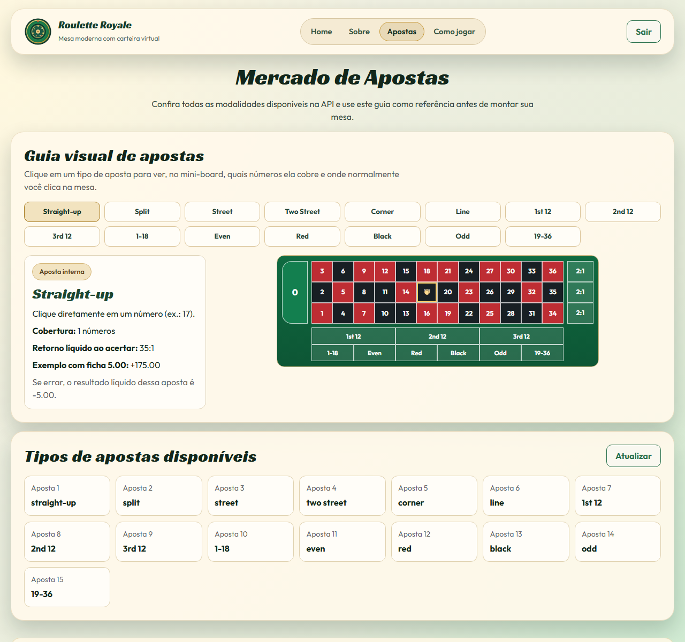
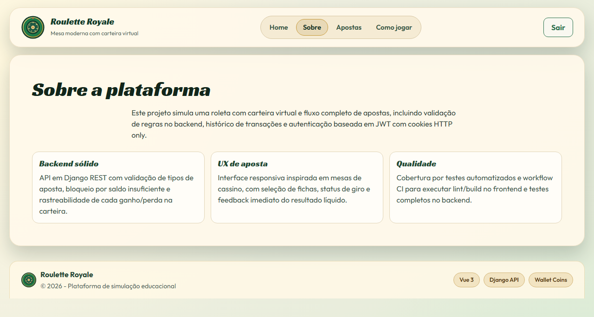
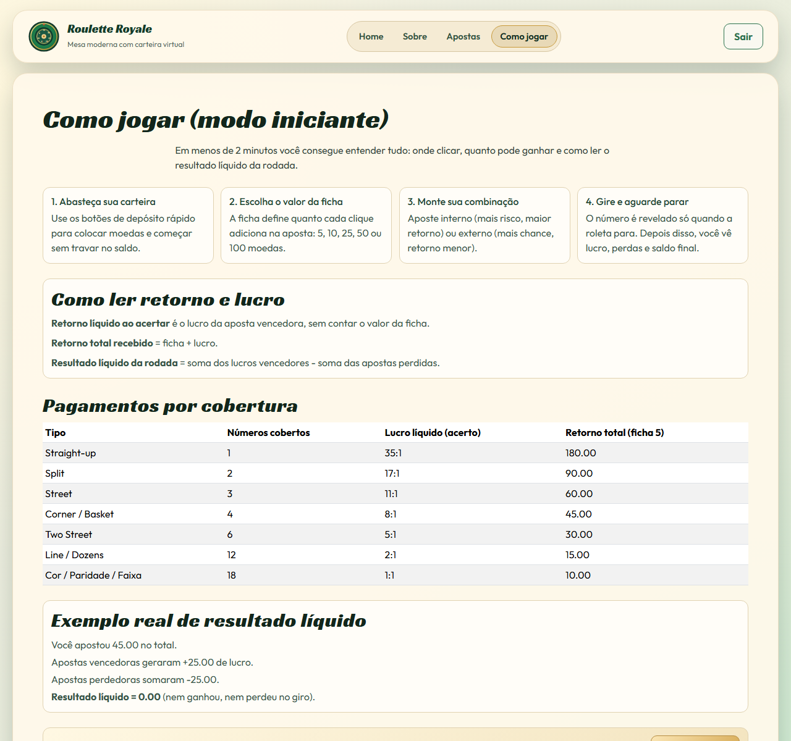
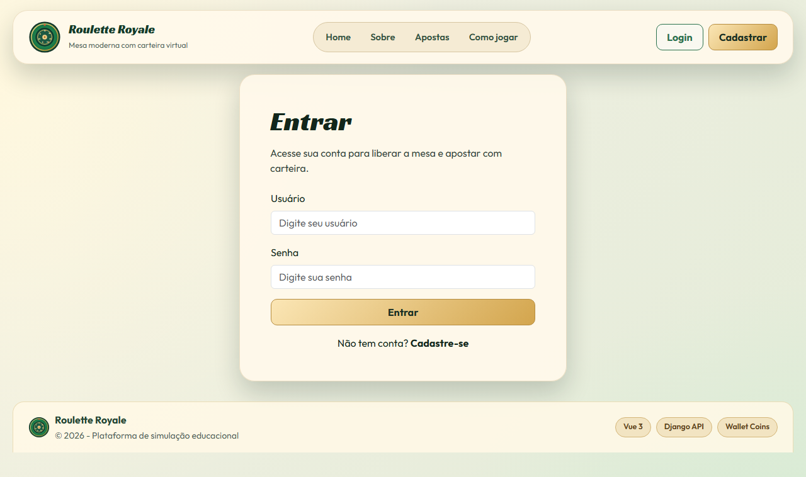
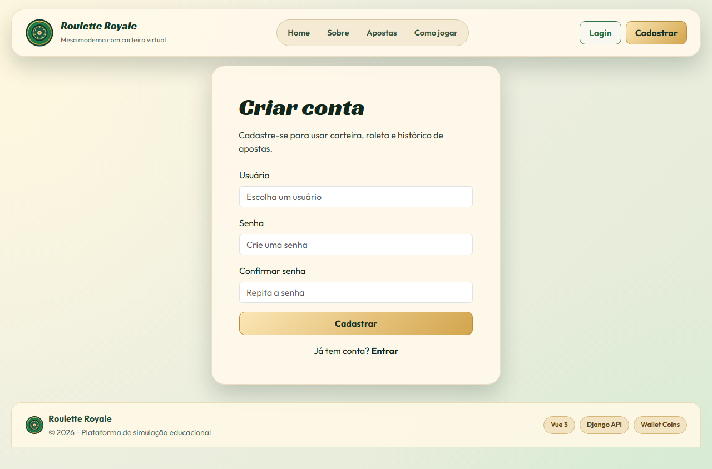

# Gallery

These screenshots were generated with Playwright capturing the full app shell (`header + main content + footer`) with an outer visual margin (not a full browser-page screenshot), after waiting for route data loading.

## Home


## Bets



## About



## FAQ / How To Play



## Login



## Register



## Regenerate Screenshots

1. Start backend and frontend.
2. Run:

```bash
cd frontend
npm run capture:screenshots -- --base-url=http://localhost:8000 --api-url=http://localhost:8080
```

Use different ports if your frontend is not running on `8000`.
